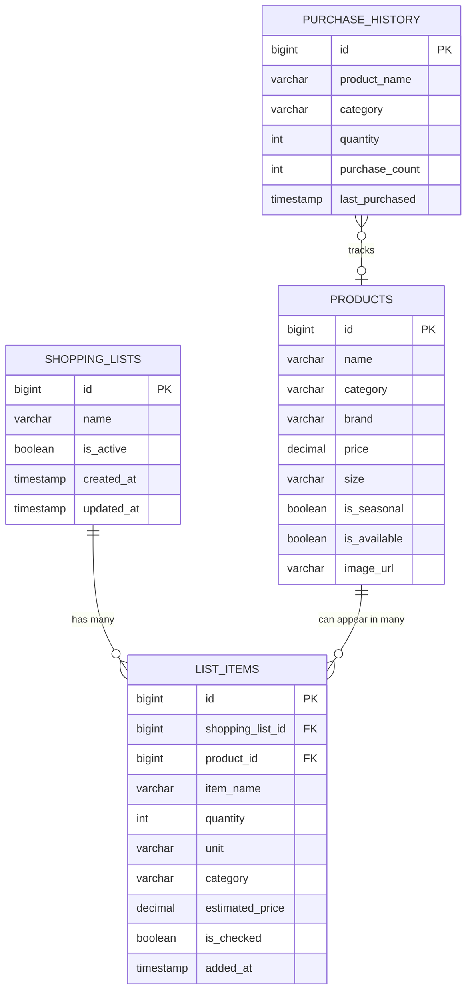

# 🛒 Voice Command Shopping Assistant

> An AI-powered, multilingual voice-driven grocery shopping list manager. Speak in any language — Hindi, Marathi, English, Tamil, Spanish, or even mixed Hinglish — and let AI handle the rest.

[](https://openjdk.org/)
[](https://spring.io/projects/spring-boot)
[](https://react.dev/)
[](https://www.postgresql.org/)
[](https://groq.com/)

### 🌐 Live Deployment

| Service | URL | Platform |
|---------|-----|----------|
| **Frontend** | [voice-command-shopping-assistant-ks.vercel.app](https://voice-command-shopping-assistant-ks.vercel.app/) | Vercel |
| **Backend API** | [voice-command-shopping-assistant-qlvo.onrender.com](https://voice-command-shopping-assistant-qlvo.onrender.com) | Render |
| **Database** | MySQL-compatible (hosted) | TiDB Cloud |

> **Note:** The backend on Render's free tier may take ~30-60 seconds to wake up on the first request after a period of inactivity.

---

## 📋 Table of Contents

1. [Project Overview](#-project-overview)
2. [Approach](#-approach)
3. [Features](#-features)
4. [Demo](#-demo)
5. [Architecture](#-architecture)
6. [Database Design](#-database-design)
7. [Technology Stack](#-technology-stack)
8. [AI Services Used](#-ai-services-used)
9. [Application Flow](#-application-flow)
10. [Project Structure](#-project-structure)
11. [Installation](#-installation)
12. [API Documentation](#-api-documentation)
13. [Future Improvements](#-future-improvements)

---

## 🔭 Project Overview

**Voice Command Shopping Assistant** is a full-stack web application that lets users manage grocery shopping lists using **natural voice commands in 9+ languages**. Instead of manually typing items, users simply speak — _"5 santri add karo"_ (Hinglish for "Add 5 oranges") — and the AI-powered backend understands the intent, translates it to English, matches it against the product catalog, and updates the shopping list in real-time.

### The Problem It Solves
Traditional shopping list apps require manual typing, are English-only, and offer no smart suggestions. This app eliminates those friction points by:
- Accepting voice commands in **any language** (Hindi, Marathi, Tamil, Telugu, Kannada, Spanish, French, German, English)
- Using **AI to understand intent** — not just keywords — so it handles typos, dialects, and mixed-language input
- Providing **smart recommendations** based on purchase history, seasonal products, and complementary items

---

## 🎯 Approach

The main challenge was handling voice commands in multiple Indian languages (Hindi, Marathi, Tamil, Hinglish) and converting them into structured shopping list actions. Instead of building a rigid keyword-based parser with hardcoded translations, I chose a **two-step LLM pipeline** — a fast 8B model for translation and a powerful 70B model for intent parsing. This approach handles mixed-language inputs, typos, and dialects without maintaining manual alias maps.

I picked **Groq** over OpenAI because its Language Processing Unit (LPU) hardware offers sub-second inference, which is critical for a voice-driven UX where users expect instant feedback. The 70B model receives the full product catalog, current list, and purchase history as context enabling it to match fuzzy product names, suggest substitutes for unavailable items, and recommend frequently bought products.

On the frontend, I used the browser's native **Web Speech API** for Speech-to-Text (STT) instead of a paid service to keep costs zero. **Zustand** was chosen over Redux for state management because of its minimal boilerplate.

For product matching, I implemented a **scoring-based fuzzy matcher** with normalization and pluralization handling as a fallback, since relying solely on the LLM for exact catalog matches wasn't reliable enough.

---

## ✨ Features

### 🎤 Voice Command Processing
- **Multilingual voice input** — Speak in English, Hindi (हिन्दी), Marathi (मराठी), Tamil (தமிழ்), Telugu (తెలుగు), Kannada (ಕನ್ನಡ), Spanish, French, or German
- **Mixed-language support** — Handles Hinglish, Marathlish, and any code-switched input
- **Natural language understanding** — Say _"add 2 kg potatoes"_ or _"दूध हटाओ"_ or _"5 santri add karo"_
- **Real-time speech visualization** — Animated voice bars while listening

### 🛒 Shopping List Management
- **CRUD operations** — Create, rename, delete multiple shopping lists
- **Add / Remove / Modify items** via voice or manual form
- **Category-wise grouping** — Items auto-organized by category (Fruits, Dairy, Vegetables, etc.)
- **Quantity management** — Voice-specified quantities are captured automatically
- **Purchase tracking** — Check off items to mark them as purchased
- **Cost estimation** — Real-time estimated total cost for the list

### 🧠 AI-Powered Smart Recommendations
- **Substitute suggestions** — If a product isn't available, the AI suggests alternatives from the same category
- **Purchase history recommendations** — _"You buy milk frequently"_ — suggests items based on past shopping behavior
- **Seasonal product highlights** — Recommends seasonal items currently available
- **Complementary item suggestions** — Based on what's already in your list (e.g., suggests bread if you added butter)


### 🔍 Product Search
- Full-text search across the product catalog
- Filter by category, price range
- Seasonal product discovery

---

## 🎬 Demo

### Voice Commands You Can Try

| Language | Voice Command | What It Does |
|----------|--------------|--------------|
| English | _"Add 2 bottles of milk"_ | Adds Whole Milk (qty: 2) |
| Hindi | _"दूध जोड़ दो"_ | Adds Whole Milk |
| Hinglish | _"5 santri add karo"_ | Adds Oranges (qty: 5) |
| Marathi | _"टोमॅटो काढ"_ | Removes Tomatoes |
| Hindi | _"आलू निकालो"_ | Removes Potatoes |
| Hindi | _"सेब ढूंढो"_ | Searches for Apples |
| Spanish | _"Añadir leche"_ | Adds Milk |
| Mixed | _"batata aur kanda add kar"_ | Adds Potatoes and Onions |

---

## 🏗 Architecture

```
┌─────────────────────────────────────────────────────────────┐
│                        Frontend                             │
│   React 19 + Vite 8 + Zustand (State) + Web Speech API     │
│                                                             │
│   ┌────────────┐  ┌──────────────┐  ┌───────────────────┐  │
│   │ VoiceAssist│  │ ShoppingList │  │ Suggestions/Search│  │
│   │ (Mic + STT)│  │ (CRUD + UI)  │  │ (AI Recs Panel)  │  │
│   └──────┬─────┘  └──────┬───────┘  └──────┬────────────┘  │
│          │               │                  │               │
└──────────┼───────────────┼──────────────────┼───────────────┘
           │               │                  │
           ▼               ▼                  ▼
    ┌──────────────── REST API (JSON) ───────────────────┐
    │                                                     │
┌───┼─────────────────────────────────────────────────────┼───┐
│   │                 Spring Boot Backend                  │   │
│   │                                                     │   │
│   │  ┌───────────────┐  ┌────────────┐  ┌───────────┐  │   │
│   │  │VoiceController│  │ListControll.│  │ProductCtrl│  │   │
│   │  └──────┬────────┘  └─────┬──────┘  └─────┬─────┘  │   │
│   │         │                 │                │        │   │
│   │  ┌──────▼─────────────────▼────────────────▼─────┐  │   │
│   │  │              Service Layer                     │  │   │
│   │  │  VoiceCommandService  │  ShoppingListService   │  │   │
│   │  └──────┬──────────────────────────┬─────────────┘  │   │
│   │         │                          │                │   │
│   │    ┌────▼────┐                ┌────▼──────┐         │   │
│   │    │ Groq AI │                │PostgreSQL │         │   │
│   │    │ (2-step)│                │    DB     │         │   │
│   │    └─────────┘                └───────────┘         │   │
│   │                                                     │   │
└───┼─────────────────────────────────────────────────────┼───┘
    │                                                     │
    │   Step 1: Translate (8B model) ──────┐              │
    │   Step 2: Parse Intent (70B model) ──┘              │
    │                                                     │
    └─────────────────────────────────────────────────────┘
```

---

## 🗄 Database Design

The application uses **4 tables** in PostgreSQL to manage the product catalog, shopping lists, list items, and purchase history.

### ER Diagram



### Table Descriptions

| Table | Purpose |
|-------|---------|
| **`products`** | Master catalog of 120+ grocery items (with brand, price, category, and seasonal/availability flags) that the AI matches voice commands against. |
| **`shopping_lists`** | User-created named shopping lists that group items together, supporting multiple lists with active/inactive state tracking. |
| **`list_items`** | Individual items added to a shopping list — links to both the list and the matched product, storing quantity, price estimate, and purchase checkbox state. |
| **`purchase_history`** | Tracks how often and when each product is purchased, enabling the AI to generate personalized "frequently bought" recommendations. |

### Relationships

- **`shopping_lists` → `list_items`** — One-to-many with cascade delete; deleting a list removes all its items.
- **`products` → `list_items`** — Many-to-one optional link; items are matched to catalog products for price/category enrichment, but can exist without a product match.

---

## 🛠 Technology Stack

### Backend
| Technology | Version | Purpose |
|------------|---------|---------|
| **Java** | 21 | Core language |
| **Spring Boot** | 3.3.4 | Application framework |
| **Spring Data JPA** | 3.3.x | ORM & database access |
| **Spring WebFlux** | 3.3.x | Non-blocking HTTP client for Groq API |
| **PostgreSQL** | 16+ | Relational database |
| **Lombok** | 1.18.x | Boilerplate reduction |
| **Jackson** | 2.x | JSON serialization/deserialization |
| **Maven** | 3.9+ | Build tool |

### Frontend
| Technology | Version | Purpose |
|------------|---------|---------|
| **React** | 19.2 | UI library |
| **Vite** | 8.1 | Build tool & dev server |
| **Zustand** | 5.0 | Lightweight state management |
| **Axios** | 1.18 | HTTP client |
| **React Router** | 7.18 | Client-side routing |
| **React Icons** | 5.7 | Icon library |
| **Web Speech API** | Browser-native | Speech-to-text recognition |

---

## 🤖 AI Services Used

### Groq Cloud API
This application uses [Groq](https://groq.com/) for ultra-fast LLM inference. Groq provides the world's fastest AI inference powered by their custom LPU (Language Processing Unit) hardware.

| Step | Model | Purpose | Why This Model |
|------|-------|---------|----------------|
| **Translation** | `llama-3.1-8b-instant` | Converts multilingual voice input to English | Lightweight & fast (~100ms). Simple translation doesn't need a large model |
| **Intent Parsing** | `llama-3.3-70b-versatile` | Parses English command into structured JSON with actions, items, recommendations | High accuracy needed for catalog matching, quantity extraction, and recommendations |

### How the AI Pipeline Works

```
User speaks: "5 santri add karo"
        │
        ▼
┌─────────────────────────────────────────────┐
│  Step 1: Translation (llama-3.1-8b-instant) │
│                                             │
│  System: "Translate this grocery command    │
│           to English. Preserve quantities   │
│           and intent words."                │
│                                             │
│  Output: "Add 5 oranges"                    │
└─────────────────┬───────────────────────────┘
                  │
                  ▼
┌─────────────────────────────────────────────┐
│  Step 2: Intent Parse (llama-3.3-70b)       │
│                                             │
│  Context: Product catalog + Current list    │
│           + Purchase history                │
│                                             │
│  Output JSON:                               │
│  {                                          │
│    "action": "ADD",                         │
│    "itemsToAdd": [                          │
│      { "name": "Oranges", "quantity": 5 }   │
│    ],                                       │
│    "recommendations": [...]                 │
│  }                                          │
└─────────────────┬───────────────────────────┘
                  │
                  ▼
         Execute against DB
```

### Web Speech API (Browser)
The **Web Speech API** is used on the frontend for real-time speech-to-text. It runs entirely in the browser (no server cost) and supports 9+ language locales:
- `en-US` (English), `hi-IN` (Hindi), `mr-IN` (Marathi), `ta-IN` (Tamil), `te-IN` (Telugu), `kn-IN` (Kannada), `es-ES` (Spanish), `fr-FR` (French), `de-DE` (German)

---

## 🔄 Application Flow

```
┌──────────┐     ┌──────────────┐     ┌──────────────┐     ┌──────────────┐
│  1. User │────►│ 2. Browser   │────►│ 3. Backend   │────►│ 4. Groq LLM  │
│  Speaks  │     │ STT (Speech  │     │ Receives     │     │ Step 1:      │
│  into    │     │ to Text)     │     │ text +       │     │ Translate    │
│  Mic     │     │              │     │ language     │     │ to English   │
└──────────┘     └──────────────┘     └──────────────┘     └──────┬───────┘
                                                                  │
                                                                  ▼
┌──────────┐     ┌──────────────┐     ┌──────────────┐     ┌──────────────┐
│  8. UI   │◄────│ 7. Frontend  │◄────│ 6. Execute   │◄────│ 5. Groq LLM  │
│  Updates │     │ Zustand      │     │ DB mutations │     │ Step 2:      │
│  with    │     │ store        │     │ (add/remove/ │     │ Parse intent │
│  results │     │ updates      │     │ modify)      │     │ + catalog    │
└──────────┘     └──────────────┘     └──────────────┘     └──────────────┘
```

### Detailed Flow

1. **User speaks** into the microphone — selects language (Hindi, English, etc.)
2. **Web Speech API** converts speech to text in real-time (interim + final results)
3. **Frontend sends** `POST /api/voice/process` with `{ text, language, listId }`
4. **Backend Step 1** — `translateToEnglish()` calls Groq's fast 8B model to translate input to English
5. **Backend Step 2** — The translated English text is sent to the 70B model along with:
   - Full product catalog context
   - Current shopping list items
   - User's purchase history
6. **LLM returns** structured JSON: action (ADD/REMOVE/MODIFY/SEARCH), items, quantities, recommendations
7. **Backend executes** the intent — adds/removes/modifies items in PostgreSQL, resolves product matches, generates substitute suggestions for unavailable items
8. **Response sent** to frontend — updated list items, search results, suggestions, and a confirmation message in the user's language

---

## 📁 Project Structure

```
Voice commanding/
│
├── voice-commanding/                    # 🔧 Spring Boot Backend
│   ├── pom.xml                          # Maven dependencies
│   ├── src/main/java/com/example/voice/commanding/
│   │   ├── VoiceCommandingApplication.java      # Spring Boot entry point
│   │   │
│   │   ├── config/
│   │   │   ├── CorsConfig.java                  # CORS configuration
│   │   │   └── GroqConfig.java                  # Groq API WebClient setup
│   │   │
│   │   ├── controller/
│   │   │   ├── VoiceController.java             # POST /api/voice/process
│   │   │   ├── ShoppingListController.java      # Shopping list CRUD endpoints
│   │   │   └── ProductController.java           # Product search & categories
│   │   │
│   │   ├── service/
│   │   │   ├── VoiceCommandService.java         # 🧠 Core AI pipeline (translate + parse)
│   │   │   ├── ShoppingListService.java         # List/item CRUD + purchase history
│   │   │   └── ProductService.java              # Product catalog operations
│   │   │
│   │   ├── model/
│   │   │   ├── Product.java                     # Product entity (catalog)
│   │   │   ├── ShoppingList.java                # Shopping list entity
│   │   │   ├── ListItem.java                    # List item entity
│   │   │   └── PurchaseHistory.java             # Purchase tracking entity
│   │   │
│   │   ├── dto/
│   │   │   ├── VoiceCommandRequest.java         # Voice input DTO
│   │   │   ├── VoiceCommandResponse.java        # API response DTO
│   │   │   ├── VoiceCommandIntent.java          # Parsed LLM intent DTO
│   │   │   ├── GroqRequest.java                 # Groq API request format
│   │   │   ├── GroqResponse.java                # Groq API response format
│   │   │   ├── ShoppingListDTO.java             # Shopping list DTO
│   │   │   ├── ListItemDTO.java                 # List item DTO
│   │   │   ├── ProductDTO.java                  # Product DTO
│   │   │   └── SuggestionDTO.java               # AI recommendation DTO
│   │   │
│   │   ├── repository/
│   │   │   ├── ProductRepository.java           # Product JPA queries
│   │   │   ├── ShoppingListRepository.java      # List JPA queries
│   │   │   ├── ListItemRepository.java          # Item JPA queries
│   │   │   └── PurchaseHistoryRepository.java   # History JPA queries
│   │   │
│   │   └── exception/
│   │       ├── GlobalExceptionHandler.java      # Centralized error handling
│   │       └── ResourceNotFoundException.java   # 404 exception
│   │
│   └── src/main/resources/
│       ├── application.properties               # DB, Groq API, CORS config
│       └── data.sql                             # Seed data for product catalog
│
└── voice-shopping-frontend/             # ⚛️ React Frontend
    ├── package.json                     # NPM dependencies
    ├── vite.config.js                   # Vite configuration
    ├── index.html                       # Entry HTML
    └── src/
        ├── main.jsx                     # React entry point
        ├── App.jsx                      # Main app layout + modals
        ├── App.css                      # Global styles (glassmorphism, dark theme)
        ├── index.css                    # CSS reset & design tokens
        │
        ├── components/
        │   ├── common/
        │   │   ├── EmptyState.jsx       # Empty list placeholder
        │   │   ├── Loader.jsx           # Loading spinner
        │   │   ├── Toast.jsx            # Toast notification component
        │   │   └── useToast.jsx         # Toast hook
        │   │
        │   ├── shopping/
        │   │   ├── AddItemForm.jsx      # Manual item add form
        │   │   ├── CategoryGroup.jsx    # Category-wise item grouping
        │   │   ├── ShoppingItem.jsx     # Individual item component
        │   │   ├── SuggestionsPanel.jsx # AI recommendations panel
        │   │   └── SearchResultsPanel.jsx # Search results display
        │   │
        │   └── voice/
        │       └── VoiceAssistant.jsx   # 🎤 Voice input + language selector
        │
        ├── services/
        │   ├── api.js                   # Axios instance + interceptors
        │   ├── voiceService.js          # Voice API calls
        │   ├── shoppingService.js       # Shopping list API calls
        │   └── productService.js        # Product API calls
        │
        └── store/
            ├── useShoppingStore.js      # Zustand store (lists, items, suggestions)
            └── useVoiceStore.js         # Zustand store (mic state, transcript)
```

---

## 🚀 Installation

### Prerequisites

- **Java 21** — [Download](https://adoptium.net/)
- **Maven 3.9+** — [Download](https://maven.apache.org/download.cgi)
- **Node.js 18+** — [Download](https://nodejs.org/)
- **PostgreSQL 16+** — [Download](https://www.postgresql.org/download/)
- **Groq API Key** — [Get free API key](https://console.groq.com/)

### 1. Clone the Repository

```bash
git clone https://github.com/your-username/voice-commanding.git
cd voice-commanding
```

### 2. Set Up PostgreSQL

```sql
-- Create the database
CREATE DATABASE voice_commanding;
```

### 3. Configure Backend

Edit `voice-commanding/src/main/resources/application.properties`:

```properties
# Database
spring.datasource.url=jdbc:postgresql://localhost:5432/voice_commanding
spring.datasource.username=postgres
spring.datasource.password=your_password

# Groq API
groq.api.key=your_groq_api_key_here
groq.api.model=llama-3.3-70b-versatile
groq.api.translation-model=llama-3.1-8b-instant
groq.api.url=https://api.groq.com/openai/v1/chat/completions
```

### 4. Run the Backend

```bash
cd voice-commanding
./mvnw spring-boot:run
```

The backend will start at `http://localhost:8080`.

### 5. Run the Frontend

```bash
cd voice-shopping-frontend
npm install
npm run dev
```

The frontend will start at `http://localhost:5173`.

### 6. Open in Browser

Navigate to **http://localhost:5173** in Chrome or Edge (required for Web Speech API support).


---

## 📡 API Documentation

### Voice Command

| Method | Endpoint | Description |
|--------|----------|-------------|
| `POST` | `/api/voice/process` | Process a voice command |

**Request Body:**
```json
{
  "text": "5 santri add karo",
  "language": "hi-IN",
  "listId": 1
}
```

**Response:**
```json
{
  "action": "ADD",
  "message": "5 संतरे आपकी सूची में जोड़ दिए गए हैं!",
  "success": true,
  "hasUnavailableItems": false,
  "updatedItems": [
    {
      "id": 12,
      "itemName": "Oranges",
      "quantity": 5,
      "category": "Fruits",
      "estimatedPrice": 80.00
    }
  ],
  "searchResults": null,
  "suggestions": [
    {
      "name": "Bananas",
      "reason": "Goes well with Oranges",
      "category": "Fruits",
      "type": "list"
    }
  ]
}
```

---

### Shopping Lists

| Method | Endpoint | Description |
|--------|----------|-------------|
| `GET` | `/api/lists` | Get all shopping lists |
| `GET` | `/api/lists/{id}` | Get a specific list with items |
| `POST` | `/api/lists` | Create a new list |
| `PUT` | `/api/lists/{id}` | Rename a list |
| `DELETE` | `/api/lists/{id}` | Delete a list |

---

### List Items

| Method | Endpoint | Description |
|--------|----------|-------------|
| `GET` | `/api/lists/{listId}/items` | Get all items in a list |
| `POST` | `/api/lists/{listId}/items` | Add an item to a list |
| `PUT` | `/api/lists/{listId}/items/{itemId}` | Update an item |
| `DELETE` | `/api/lists/{listId}/items/{itemId}` | Delete an item |
| `PATCH` | `/api/lists/{listId}/items/{itemId}/toggle` | Mark item as purchased |

---

### Products

| Method | Endpoint | Description |
|--------|----------|-------------|
| `GET` | `/api/products/search?q=&category=&minPrice=&maxPrice=` | Search products |
| `GET` | `/api/products/categories` | Get all product categories |
| `GET` | `/api/products/seasonal` | Get seasonal products |

---

## 🔮 Future Improvements

- [ ] **Offline Mode** — Service Worker + IndexedDB for offline list access and sync
- [ ] **Voice Response (TTS)** — Read back confirmations using browser Text-to-Speech API
- [ ] **Barcode Scanner** — Add items by scanning product barcodes using the camera
- [ ] **Price Comparison** — Integrate with store APIs to compare prices across retailers
- [ ] **Image-based Product Recognition** — Take a photo of a product to add it to the list

---

<p align="center">
  Made with ❤️ using Spring Boot, React, and Groq AI
</p>
